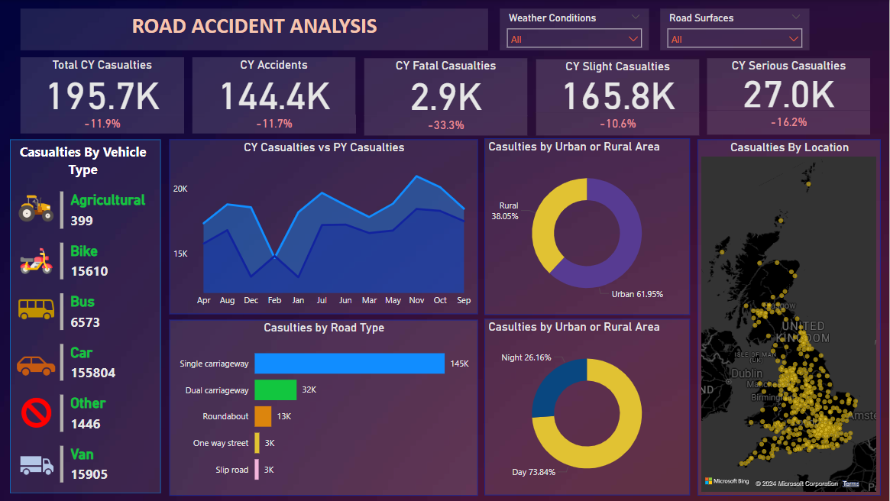

# Road Accident Analysis Report

This repository contains a comprehensive **Road Accident Analysis** report developed using **Power BI**. The analysis aims to provide valuable insights into accident trends, severity, and casualties for the years 2021 and 2022, helping stakeholders make informed decisions to improve road safety.

## Report Overview

The Road Accident Analysis report focuses on:

- **Primary KPIs**:
  - Total casualties and total accidents for the current year.
  - Year-over-Year (YoY) growth in casualties and accidents.
  - Casualties categorized by accident severity.

- **Secondary KPIs**:
  - Casualties by vehicle type.
  - Casualties by road type.
  - Casualties by area/location and time of day (day/night).

- **Visual Insights**:
  - Monthly trends comparing casualties for the current and previous year.
  - Location-based analysis of total casualties and accidents.

## Key Features

1. **Interactive Dashboards**:
   - Year-over-Year (YoY) analysis of key metrics.
   - Breakdown of casualties by accident severity, road type, and vehicle type.
   - Time-of-day analysis (day/night) for better visibility into when accidents occur.

2. **Dynamic Visualizations**:
   - Line charts for monthly casualty trends.
   - Bar charts and maps for regional and categorical insights.
   - Pie charts and tree maps for detailed breakdowns.

3. **Actionable Insights**:
   - Helps identify high-risk areas and accident patterns.
   - Facilitates data-driven decision-making to improve road safety measures.
## Screenshots



## How to Use This Report

1. Clone the repository:
   ```bash
   git clone https://github.com/yourusername/road-accident-analysis.git
   ```

2. Open the Power BI file `Road_Accident_Analysis.pbix` using [Power BI Desktop](https://powerbi.microsoft.com/).

3. Use the SQL queries provided above to update the database views or load new data.

4. Explore the visuals and dashboards to uncover actionable insights.


## About the Dataset

The dataset includes anonymized data points such as:

- Accident severity and casualties.
- Vehicle types involved.
- Road types and locations.
- Accident timing (day/night).

> Ensure compliance with data privacy regulations when handling sensitive data.
